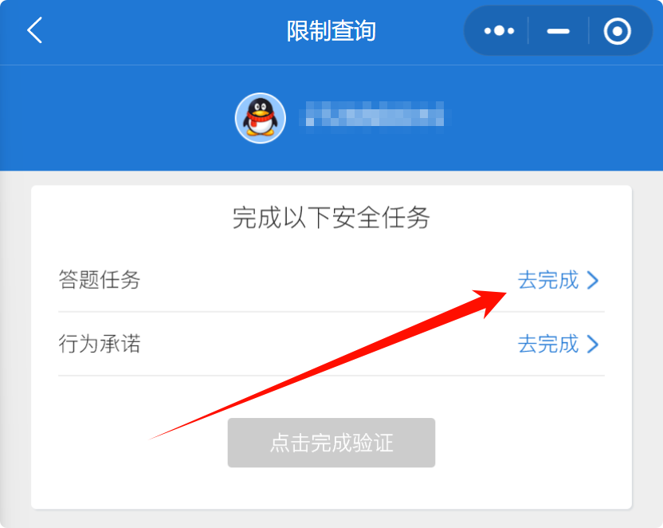

好的，根据您的新项目结构和代码的重大更新，这里是一份完全重写的 `README.md` 文件。它保留了原有风趣的语调，但全面反映了新技术、新功能和新工作流程。

---

# 王者荣耀“蓄意战败”答题脚本 - 2.0 智能进化版

> 我，雅典娜玩家，绝不认输！没人比我们更想赢。面对“蓄意战败”禁赛的答题以及不平等条约，我选择用代码无脑答题！

**编写此代码纯属也是为了玩，我只进行了答题，未签不平等条约！！！**

应粉丝及评论区要求，放出并更新完善代码：[B站视频地址](https://www.bilibili.com/video/BV1TFGAzPEWc)

> **重大升级**
> 此版本为对旧版脚本的 **彻底重构**。我们告别了笨重且不稳定的OCR识别，迎来了一个基于剪贴板HTML解析的 **高速、精准、智能的答题解决方案**。它不再是单纯的暴力破解，而是一个能够自我学习和进化的智能系统。

---

## 声明

**本项目仅供学习和技术交流使用，请勿用于任何商业或非法用途。滥用自动化工具可能违反游戏的用户协议，使用者需自行承担一切风险。**

玩游戏也是玩，写代码也是玩。本项目旨在探索如何用 Python 实现桌面自动化，顺便不服不合理的系统蓄意战败禁赛机制。

## 项目介绍

这是一个基于 `pyautogui`、`pywin32` 和 `BeautifulSoup` 的高级自动化答题脚本。它通过模拟“全选-复制”操作，直接从剪贴板的HTML格式中读取题目、选项（包括文字和图片）、以及当前选中状态，从而实现 **100%精准** 的题目信息获取。

更进一步，本项目引入了 **智能题库系统**。脚本会优先使用题库中的答案秒解题目。当遇到新题时，它会回退到遍历模式进行解答，并将成功解出的答案记录下来。通过配套的合并工具，你可以不断地扩充和完善你的主知识库，让脚本越用越聪明！

## 功能特性

-   **🚀 高可靠HTML解析**：彻底抛弃OCR，通过解析剪贴板HTML，实现对题目、选项（文字/图片）和选中状态的 **零失误** 读取。
-   **🧠 智能题库优先**：优先从 `master_qa_bank.json` 题库中查找答案。不仅匹配问题，还智能匹配选项集，能应对选项顺序/内容不同的变种题目。
-   **🤖 自动学习与进化**：当通过遍历模式解出新题后，会自动生成 `solution_map.json`。你可以使用 `tools/merge_tool.py` 将其智能合并到主题库中，实现知识的积累和进化。
-   **💪 健壮的容错机制**：
    -   **点击验证**：在多选题中，点击选项后会再次验证是否成功选中，大大提高了复杂操作的成功率。
    -   **解题重试**：当一次解题失败（如网络卡顿），脚本会自动重试，而非直接崩溃。
-   **🔧 高度可配置**：所有核心参数（延时、相似度、功能开关等）均在脚本顶部集中配置，并附有详细注释。
-   **📊 详细的日志与产物**：每次运行都会生成带时间戳的独立日志和截图文件夹，方便追踪和分析。

## 项目结构

```
HonorUnban/
├── .gitignore
├── auto_solver_refactored.py   # ⭐ 全新的主程序，智能答题核心
├── master_qa_bank.json         # ⭐ 主题库文件，脚本的“大脑”
├── readme.md
├── requirements.txt            # 新的依赖库列表
├── assert/                     # (未来可能使用) 断言资源文件夹
├── logs/                       # (自动生成) 日志文件夹
├── screenshots/                # (自动生成) 截图与答案文件夹
│   └── 20240520_131400/        # 本次运行的专属文件夹
│       ├── 第1题_1_find_submit.png
│       └── solution_map.json   # 本次运行学到的新知识
├── templates/                  # 模板图片文件夹（仅用于定位点击位置）
│   ├── option_A_1.png
│   └── ...
└── tools/                      # 辅助工具文件夹
    ├── get_region_tool.py      # 获取屏幕区域坐标工具
    ├── merge_tool.py           # ⭐ 智能题库合并工具
    └── test_rtf_parser.py      # 剪贴板诊断工具
```

## 环境准备

1.  **安装 Python**: 建议使用 Python 3.8 或更高版本。
2.  **安装依赖库**:
    > **注意**: 本脚本的核心功能依赖 `pywin32`，目前 **仅在 Windows 系统上能发挥最佳性能**。

    打开终端（或命令提示符），使用 `cd` 命令进入项目根目录，然后运行：
    ```bash
    pip install -r requirements.txt
    ```
    **`requirements.txt` 文件内容:**
    ```txt
    pyautogui
    opencv-python
    airtest
    numpy
    pywin32
    beautifulsoup4
    ```

## 如何使用
### 准备工作
打开电脑微信进入小程序“腾讯游戏安全中心”，进入小程序主页面找到并点击“限制查询”，进入后找到“王者荣耀”进入，如果可以的话能看见“申请限制解除”点击，就进入到答题页面了。




### 第一步：获取答题区域坐标

你需要告诉脚本你的答题界面在屏幕的哪个位置，以便它能正确点击。

1.  打开你的答题界面（推荐使用 **电脑端微信小程序**，因为它能完美支持HTML复制）。
2.  运行 `tools/get_region_tool.py` 脚本，根据提示获取区域坐标，并 **复制生成的 `SCREEN_REGION = ...` 代码**。
3.  **或者**，直接在终端运行 `python -c "import pyautogui; pyautogui.displayMousePosition()"`，手动记录左上角和右下角坐标，计算出`(x, y, width, height)`。

### 第二步：配置主脚本

打开主脚本 `auto_solver_refactored.py`，找到顶部的全局配置区域。

1.  **粘贴区域坐标**：将上一步复制的 `SCREEN_REGION = ...` 代码粘贴到配置区。
2.  **配置题库模式**:
    -   `USE_QA_BANK = True`: (默认) 开启智能题库模式。
    -   `QA_BANK_FILE = "master_qa_bank.json"`: 指定你的主题库文件。
3.  **配置滚动模式**: `SCROLL_MODE = 'PC_WHEEL'` 是在PC上最推荐的模式。
4.  **(可选) 调整参数**: 如果遇到问题，可以微调延时、重试次数或图像识别相似度等参数。

### 第三步：准备模板图片

尽管脚本不再依赖图像识别题目内容，但仍需要模板图片来 **定位选项和提交按钮的点击位置**。

1.  确保 `templates` 文件夹存在。
2.  对你的答题界面的 **A, B, C, D 选项图标** 和 **提交按钮** 进行截图。截图越小、越清晰越好。
3.  将截图按以下规则命名并保存到 `templates` 文件夹：
    -   `option_A_1.png`, `option_B_1.png`, ...
    -   `submit_button.png`
    -   如果某个选项有多种状态（如选中/未选中），可以截取多张图，命名为 `option_A_1.png`, `option_A_2.png` 等。

### 第四步：运行脚本

一切就绪！确保答题界面在前台且无遮挡。

在终端中运行主脚本：
```bash
python auto_solver_refactored.py
```
脚本会进行初始化和环境预检，然后开始高速答题。

### 第五步：进化你的题库！(关键)

每次脚本运行结束后，如果学到了新题目，会在 `screenshots/` 对应时间的文件夹下生成一个 `solution_map.json`。这是宝贵的知识！

要将这些新知识合并到你的主题库中，请运行合并工具：
```bash
python tools/merge_tool.py
```
该工具会自动扫描所有 `solution_map.json` 文件，并智能地将它们合并到 `master_qa_bank.json` 中。下次再运行主脚本时，它就已经学会这些新题了！

## 运行产物

-   `logs/`: 存放详细的运行日志。
-   `screenshots/`: 存放截图和 **学习成果 (`solution_map.json`)**。

**`solution_map.json` (学习成果) 示例:**
```json
{
    "1. 以下哪个行为属于【蓄意战败】？": [
        {
            "options": [
                "出装不合理，被队友善意提醒后，仍然我行我素",
                "在游戏中态度积极，但因为实力不济导致评分过低",
                "和队友争抢位置，进入对局后持续进行言语辱骂",
                "逆风时坚持防守，寻找翻盘机会"
            ],
            "answer": [
                "出装不合理，被队友善意提醒后，仍然我行我素",
                "和队友争抢位置，进入对局后持续进行言语辱骂"
            ]
        }
    ]
}
```

## 常见问题 (FAQ)

**Q: 脚本运行了，但没有点击任何按钮。**
**A:**
1.  **区域坐标错误**: 检查 `SCREEN_REGION` 配置是否正确。
2.  **模板不匹配**: 检查 `templates` 文件夹里的图片是否清晰、命名是否正确。
3.  **窗口未激活**: 确保答题窗口在最前端。脚本启动时会尝试自动激活，但手动点一下更保险。

**Q: 提示 "未能从剪贴板获取HTML内容"。**
**A:**
1.  **环境问题**: 确认你在 **Windows** 系统下运行，并已安装 `pywin32`。
2.  **应用不支持**: 确保你使用的答题客户端（如PC微信小程序）支持将内容以HTML格式复制到剪贴板。某些投屏软件可能只支持纯文本或图像复制。

**Q: 脚本卡在某个题目，不断重试但无法解决。**
**A:**
1.  **延时太短**: 你的电脑或网络可能较慢。尝试在配置中增加 `FIXED_POST_SUBMIT_DELAY` 和 `RETRY_DELAY_BETWEEN_ATTEMPTS` 的值。
2.  **点击验证失败**: 这可能是UI响应极慢导致的。尝试增加 `DELAY_BEFORE_VERIFY_CLICK` 的值。

---
**最后，再次声明：雅典娜玩家永不为奴！除非包吃包住，并且代码能自动进化。**